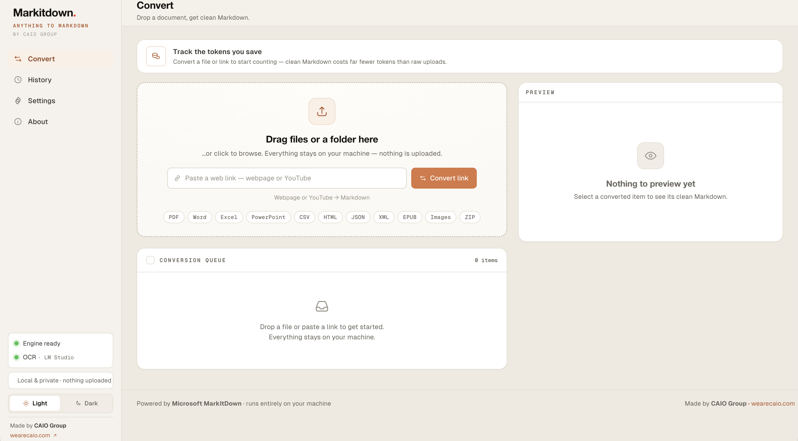
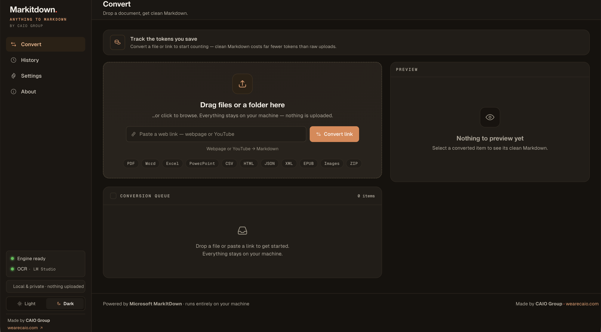
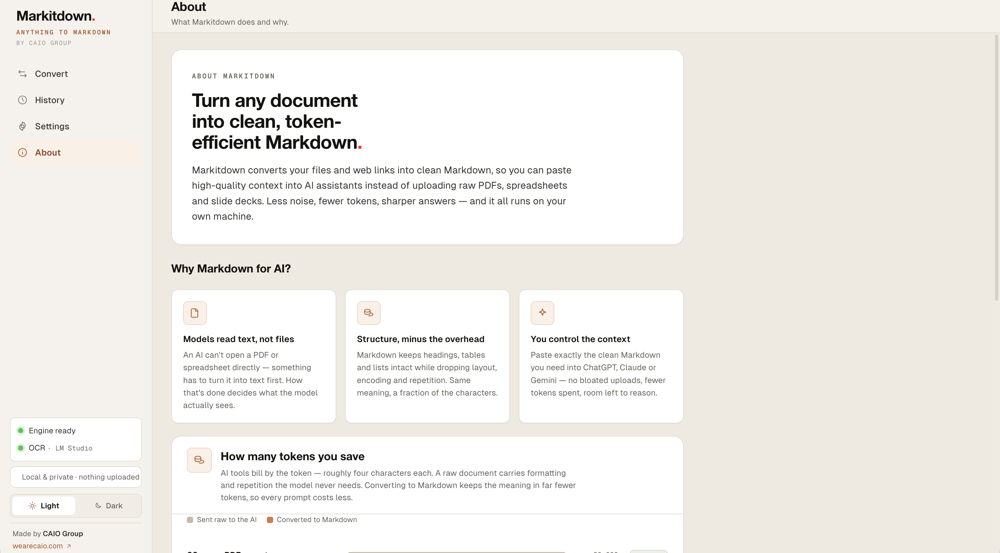

<div align="center">

# Markdown Anywhere

### Anything to Markdown — 100% on your machine.

Turn **PDFs, Word, Excel, PowerPoint, images, ZIPs, and web links** into clean,
token-efficient **Markdown** — so you can paste high-quality context into ChatGPT,
Claude, or Gemini instead of uploading raw files and burning tokens.

Powered by Microsoft [MarkItDown](https://github.com/microsoft/markitdown).
Built by [CAIO Group](https://wearecaio.com).


<br/>



</div>

---

## Why this exists

AI assistants bill by the **token**, and a token is roughly four characters. A raw
PDF, spreadsheet, or slide deck carries layout, encoding, and repetition the model
never needs — often **3–4× more tokens** than the same content as clean Markdown.

**Markdown Anywhere** converts your documents locally and gives you tidy Markdown to
paste instead. Less noise, fewer tokens, sharper answers — and **nothing ever leaves
your computer**.

> Typical savings: a 20-page scanned PDF ≈ **−75%** tokens · an Excel workbook ≈ **−73%** · a slide deck ≈ **−75%**.

---

## Features

- **Drag-and-drop** files (or a whole folder), or **paste a web link** (web pages and
  YouTube transcripts).
- **Formats:** PDF, Word (`.docx`), Excel (`.xlsx/.xls`), PowerPoint (`.pptx`), CSV,
  HTML, JSON, XML, EPUB, Outlook `.msg`, images, audio, and **ZIP** (expands and
  converts everything inside).
- **Smart PDF structure** — reconstructs headings (by font size) and reads
  multi-column pages in the correct order. Optional **AI mode** sends each page to a
  local vision model for best layout/tables fidelity.
- **Local OCR** for images and scanned PDFs via **Ollama** or **LM Studio** — your
  files never touch the cloud.
- **Token-savings counter** showing how much you save per session.
- **Queue power tools:** preview (rendered ⇄ raw), copy, download `.md`, rename,
  drag-to-reorder, **merge several into one document**, **download all as a zip**, and
  **save to a folder** of your choice.
- **History** of the session and a **Settings** panel that persists between launches.
- **Light & dark themes.**
- **Single local app, no accounts, no telemetry, no uploads.**

---

## Screenshots

| Convert — light | Convert — dark |
|:---:|:---:|
|  |  |



---

## Quick start

### 1. Install Python 3.10+
One-time. Download from [python.org/downloads](https://www.python.org/downloads/).
On **Windows**, tick **“Add Python to PATH”** during install.

### 2. Launch
- **macOS:** double-click **`start.command`**
- **Windows:** double-click **`start.bat`**

The first launch finds your Python, creates a virtual environment, installs
dependencies (a few minutes), and opens your browser at
**http://127.0.0.1:8400**. Every launch after is instant. Close the
terminal window it opens to stop the app.

> Prefer the command line?
> ```bash
> python3 -m venv venv
> ./venv/bin/pip install -r requirements.txt
> ./venv/bin/python -m uvicorn server.app:app --host 127.0.0.1 --port 8400
> ```

---

## Using it

The app has four sections in the sidebar:

| Section | What it does |
|--------|---------------|
| **Convert** | Drop files or paste a link. Each item lands in a queue you can preview, copy, download, rename, reorder, merge, zip, or save to a folder. |
| **History** | A dashboard of your conversions kept locally for a retention window you choose (Settings → History; default 7 days, or Off). Shows per-model performance (avg time, time/page), totals, and lets you re-download, merge, zip, or save past results. |
| **Settings** | Output folder + auto-save, OCR, PDF mode, theme. |
| **About** | Why Markdown saves tokens, with examples. |

### PDF conversion modes (Settings → PDF conversion)
- **Fast — structured** *(default)*: a built-in extractor that detects headings by
  font size and fixes multi-column reading order. Instant, offline, never rewrites
  your text.
- **AI — vision model**: renders each page and sends it to your local vision model
  for the best layout, tables, and reading order. Slower (one pass per page) and
  requires a connected model (see below).

### Image & scanned-PDF OCR (optional, fully local)
Images and scanned/image-only PDFs need a local vision model. Either works:

- **Ollama** — install from [ollama.com](https://ollama.com), then:
  ```bash
  ollama pull qwen2.5vl:7b        # lighter machines: granite3.2-vision:2b
  OLLAMA_ORIGINS=* ollama serve   # allow the local app to call it
  ```
- **LM Studio** — load a vision model (e.g. a Gemma or Qwen-VL model) and start its
  local server.

Then in **Settings → Enable OCR**, click **Test connection** to load the model list
and pick your model. Now drop an image or scanned PDF (or switch PDF mode to AI).

---

## Privacy

Your files and OCR run **100% on your machine** — nothing is uploaded, no account,
no telemetry. The **only** outbound network request is when *you* paste a web link
(that page or YouTube content is fetched from the internet to convert it).

---

## How it works

```
Browser UI  ──HTTP──▶  Local FastAPI server  ──▶  Microsoft MarkItDown engine
(vanilla JS)            (127.0.0.1:8400)            + pdfplumber (structured PDF)
                                                    + local vision model (OCR / AI PDF)
```

- **Backend** (`server/`): Python + FastAPI. Wraps `markitdown[all]`; adds a
  structured PDF extractor (`pdf_text.py`), a vision-OCR fallback (`pdf_ocr.py`), and
  endpoints for saving, folder selection, model listing, and persisted settings.
- **Frontend** (`web/`): plain HTML/CSS/JS — **no build step, no framework runtime**.
  Markdown is rendered with `marked` and sanitized with `DOMPurify`. Fonts and
  libraries are vendored locally for full offline use.

### API endpoints
| Method & path | Purpose |
|---|---|
| `POST /api/convert` | Convert an uploaded file (multipart) |
| `POST /api/convert-url` | Convert a web link / YouTube URL |
| `GET /api/ocr-status` | Detect a local vision model |
| `GET /api/models?endpoint=` | List models on a local LLM server |
| `POST /api/save` | Save Markdown files to a folder |
| `POST /api/open-folder` | Reveal a folder in the OS file manager |
| `POST /api/pick-folder` | Open the native folder chooser |
| `GET` / `POST /api/settings` | Read / persist settings |

---

## Project structure

```
markdown-anywhere/
├── server/            FastAPI app + conversion logic (converter, pdf_text, pdf_ocr, ocr, storage, settings)
├── web/               Vanilla UI (index.html, app.js, styles.css, icons.js, lib.js, vendored libs + fonts)
├── tests/             pytest (Python logic) + node --test (frontend helpers) + fixtures
├── start.command      macOS launcher
├── start.bat          Windows launcher
├── requirements.txt
├── LICENSE            MIT
└── README.md
```

---

## Development

No build pipeline — edit files and refresh. Run the tests on your machine:

```bash
# Python (conversion logic, endpoints)
./venv/bin/python -m pytest -q

# Frontend pure logic (Node 18+)
node --test 'tests/*.test.js'
```

Contributions welcome — open an issue or PR.

### Roadmap ideas
- Live per-page OCR progress (server-sent events).
- Smarter callout/pull-quote handling in the fast PDF extractor.
- A packaged double-clickable build with a bundled Python runtime.

---

## Credits

- Conversion engine: **[Microsoft MarkItDown](https://github.com/microsoft/markitdown)**.
- PDF text/layout: [pdfplumber](https://github.com/jsvine/pdfplumber) · rendering: [pypdfium2](https://github.com/pypdfium2-team/pypdfium2).
- UI libraries (vendored): [marked](https://github.com/markedjs/marked), [DOMPurify](https://github.com/cure53/DOMPurify), [JSZip](https://github.com/Stuk/jszip), [Geist](https://github.com/vercel/geist-font) fonts.
- Local vision models via [Ollama](https://ollama.com) / [LM Studio](https://lmstudio.ai).

Made by **[CAIO Group](https://wearecaio.com)** — *AI is an intelligence to communicate with, not a tool to operate.*

## License

[MIT](LICENSE) © 2026 CAIO Group (Stefanos Karagos)
